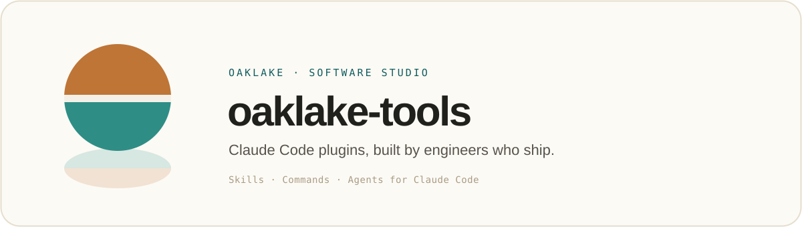
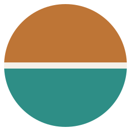

<p align="center">
  <a href="https://oaklake.studio">
    
  </a>
</p>

<p align="center">
  <strong>oaklake-tools</strong> is <a href="https://oaklake.studio">Oaklake</a>'s <a href="https://code.claude.com">Claude Code</a> plugin marketplace:<br>
  the skills, commands, and agents we build for our own work, packaged so you can use them too.
</p>

<p align="center">
  Small, deliberate, production-tested. The tooling around the work: the demos, the deploys, the glue that keeps things running quietly.
</p>

---

## Install

Add the marketplace once, then install whatever you need:

```
/plugin marketplace add oaklake-studio/oaklake-tools
/plugin install demo-gif@oaklake-tools
```

Pull in new tools as we ship them with `/plugin marketplace update oaklake-tools`.

> [!TIP]
> Kicking the tires locally? Point Claude Code at a clone instead:
> `/plugin marketplace add /path/to/oaklake-tools`

## What's inside

A growing set: two plugins today, more on the way.

| Plugin | What it does | Install |
| --- | --- | --- |
| **[demo-gif](plugins/demo-gif)** | Records a **calm, followable demo GIF** of any web UI (for a PR, README, or changelog). Claude drives a browser through a short scripted flow (Playwright), records one continuous take, and converts it to a palette-optimized GIF under `.demo-gifs/` (auto-gitignored). | `demo-gif@oaklake-tools` |
| **[engineering-conventions](plugins/engineering-conventions)** | Injects **Oaklake's engineering conventions** into context at the start of every session, via a SessionStart hook that prints `conventions.md`. General, non-private house rules for code, changes, and writing. | `engineering-conventions@oaklake-tools` |

> [!NOTE]
> **demo-gif prerequisites:** Python ≥ 3.9, `ffmpeg` on `PATH`, and Google Chrome (or a one-time bundled-Chromium download). POSIX shell. On Windows use WSL or git-bash. Full detail in **[plugins/demo-gif/README.md](plugins/demo-gif/README.md)**.

## How it's laid out

Each tool is a self-contained [Claude Code plugin](https://docs.claude.com/en/docs/claude-code/plugins) under `plugins/`, listed in the marketplace manifest:

```
.claude-plugin/marketplace.json   the marketplace: lists every plugin
plugins/
  demo-gif/                        one plugin per directory
    .claude-plugin/plugin.json     name, version, metadata
    skills/                        the skill(s) it ships
    README.md                      what it does + prerequisites
assets/                            shared Oaklake brand marks
```

Adding a tool means dropping a new directory under `plugins/` and listing it in `marketplace.json`. Nothing else moves.

## License

MIT. See [LICENSE](LICENSE).

<br>

<div align="center">
  
  <br>
  <sub>Built by <a href="https://oaklake.studio"><strong>Oaklake</strong></a>, an independent software studio.<br>
  Software, built by engineers who ship. · <a href="mailto:hi@oaklake.studio">hi@oaklake.studio</a></sub>
</div>
