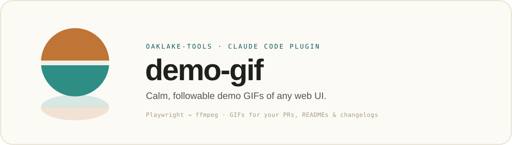

<p align="center">
  
</p>

<p align="center">
  <sub>A plugin in <a href="../../README.md"><strong>oaklake-tools</strong></a>, <a href="https://oaklake.studio">Oaklake</a>'s Claude Code marketplace.</sub>
</p>

---

A Claude Code skill that records a **calm, followable demo GIF of any web UI** (for a PR, README, changelog, or showcase). Claude drives a browser through a short scripted flow you define with it, records one continuous video, and converts it to a palette-optimized GIF.

## What it does

- Sets up Playwright once in a dedicated venv (`~/.cache/claude/demo-gif/venv`) that your project's dependency manager won't prune, and drives **system Chrome** (falling back to bundled Chromium).
- Scopes the demo with you (URL, login, 3–4 deliberate beats), records headless, verifies each beat by screenshot, then trims and converts with a two-pass ffmpeg palette.
- Saves the result to **`.demo-gifs/<name>-v<N>.gif`** at the project root and adds `.demo-gifs/` to `.gitignore` when the root is a git repo (GIFs are large binaries: artifacts, not repo files).

## Requirements

- **Python ≥ 3.9** (for the Playwright venv). POSIX shell (macOS/Linux; on Windows use WSL or git-bash)
- **ffmpeg** on `PATH` (`brew install ffmpeg` / `apt-get install ffmpeg` / `dnf install ffmpeg` / `choco install ffmpeg`)
- **Google Chrome** installed (preferred), or the skill fetches bundled Chromium once (~150 MB)

## Usage

Install it from the marketplace:

```
/plugin marketplace add oaklake-studio/oaklake-tools
/plugin install demo-gif@oaklake-tools
```

Then just ask Claude: *"make a demo gif of the checkout flow"*. It invokes the skill, asks for the base URL / login / beats, and produces the GIF. Not for terminal/CLI recordings, and not for real third-party SSO logins on camera (see the skill's hybrid-capture note).

## License

MIT
