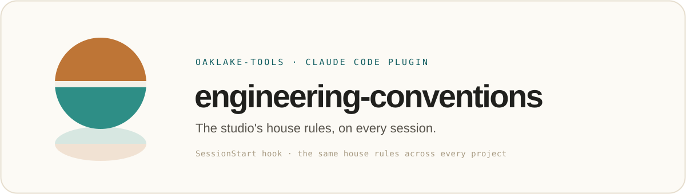

<p align="center">
  
</p>

<p align="center">
  <sub>A plugin in <a href="../../README.md"><strong>oaklake-tools</strong></a>, <a href="https://oaklake.studio">Oaklake</a>'s Claude Code marketplace.</sub>
</p>

---

Injects Oaklake Studio's engineering conventions into Claude's context at the start of every session, so the assistant follows the same house rules across projects without you repeating them.

## What it does

A `SessionStart` hook fires on every session start (new, resumed, cleared, or after compaction) and prints [`conventions.md`](conventions.md) into context. It covers how we write code, how we make changes, frontend basics, communication, and a rule against prose that reads as AI-generated.

These are general, non-private conventions. Nothing project-specific, personal, or internal belongs here.

## Install

```
/plugin marketplace add oaklake-studio/oaklake-tools
/plugin install engineering-conventions@oaklake-tools
```

## Customize

Edit [`conventions.md`](conventions.md). Whatever it contains is exactly what gets injected; there is no other configuration. Keep it tight, since it loads on every session.

## How it's laid out

```
.claude-plugin/plugin.json   name, version, metadata
hooks/hooks.json             the SessionStart hook (cats conventions.md into context)
conventions.md               the conventions text that gets injected
assets/banner.svg            brand banner (self-contained SVG)
```

## License

MIT
